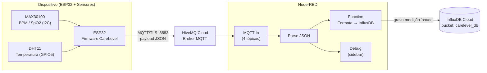

# CareLevel — Monitoramento de Sinais Vitais (IoT)

Sistema de monitoramento contínuo de sinais vitais (frequência cardíaca, saturação de oxigênio e temperatura corporal) baseado em ESP32, com transmissão dos dados via MQTT (HiveMQ Cloud), processamento em Node-RED e persistência em InfluxDB Cloud para posterior análise.

---

## 📌 Contexto Acadêmico

- **Instituição:** FIAP
- **Curso / Disciplina:** Engenharia de Software
- **Turma / Fase / Sprint:** 1ESPS 2º Semestre - Sprint 3
- **Integrantes:**
| Nome | RM |
|---|---|
| Camile Vitória Silva | RM 566649 |
| Gustavo Almeida Ferreira | RM 566980 |
| Lucas de Oliveira Miranda Caetano | RM 568036 |
| Marco Túlio Longo Conte | RM 568373 |
| Sofia Souza Rodrigues | RM 566708 |

---

## 📋 Sobre o Projeto

O **CareLevel** é um dispositivo vestível/de monitoramento que coleta, em tempo real:

- **Batimentos cardíacos (BPM)** e **saturação de oxigênio (SpO2)** via sensor **MAX30100**;
- **Temperatura corporal** via sensor **DHT11**.

Os dados são lidos por um **ESP32**, enviados via **MQTT sobre TLS** para um broker na nuvem (**HiveMQ Cloud**) e consumidos por um fluxo **Node-RED**, que normaliza as informações e as grava em um banco de séries temporais (**InfluxDB Cloud**), permitindo consultas e análises históricas dos sinais vitais.

---

## 🏗️ Arquitetura da Solução



### Fluxo resumido

1. O **ESP32** lê os sensores a cada ciclo e, a cada **5 segundos**, publica 4 mensagens JSON (uma por grandeza) nos tópicos MQTT.
2. O **HiveMQ Cloud** recebe as mensagens via conexão segura (TLS, porta 8883).
3. O **Node-RED** está inscrito nos 4 tópicos, converte o payload (string → objeto JSON) e:
   - envia uma cópia para o **Debug** (acompanhamento em tempo real);
   - encaminha para a função **"Formata → InfluxDB Cloud"**, que monta o objeto de campos (`fields`) e define a *measurement* `saude`.
4. O nó **InfluxDB Out** grava o ponto na *measurement* `saude`, no bucket `carelevel_db` do InfluxDB Cloud.

---

## 🔩 Hardware Utilizado

| Componente | Função | Conexão no ESP32 |
|---|---|---|
| ESP32 (DevKit) | Microcontrolador principal, Wi-Fi | — |
| MAX30100 | Oxímetro de pulso (BPM e SpO2) | I2C — SDA → GPIO21, SCL → GPIO22 |
| DHT11 | Sensor de temperatura/umidade | GPIO5 |

---

## 💻 Software e Bibliotecas

### Firmware (Arduino/ESP32)

| Biblioteca | Autor | Versão |
|---|---|---|
| Adafruit Unified Sensor | Adafruit | 1.1.15 |
| ArduinoJson | Benoit Blanchon | 7.4.3 |
| DHT sensor library | Adafruit | 1.4.7 |
| MAX30100lib | OXullo Intersecans | 1.2.1 |
| PubSubClient | Nick O'Leary | 2.8 |
| WiFi / WiFiClientSecure | Core ESP32 (Espressif) | incluso no core |

### Plataforma de processamento

| Ferramenta | Função |
|---|---|
| **Node-RED** | Orquestração e tratamento dos dados recebidos via MQTT |
| **node-red-contrib-influxdb** (v0.7.0) | Nó de integração Node-RED ↔ InfluxDB |
| **HiveMQ Cloud** | Broker MQTT (TLS) |
| **InfluxDB Cloud (v2)** | Banco de dados de séries temporais |

---

## 📁 Estrutura do Repositório

```
.
├── README.md
├── firmware/
│   └── CareLevel_FisicoFinal/
│       └── CareLevel_FisicoFinal.ino     # Código-fonte do ESP32
├── platform/
│   └── node-red/
│       └── flows.json                    # Fluxo exportado do Node-RED
└── docs/
    └── architecture.png                  # (opcional) imagem exportada do diagrama acima
```

---

## ⚙️ Configuração da Plataforma

### 1. HiveMQ Cloud (Broker MQTT)

1. Criar um cluster gratuito em [HiveMQ Cloud](https://www.hivemq.com/mqtt-cloud-broker/).
2. Anotar o **host** do cluster (ex: `xxxxxxxx.s1.eu.hivemq.cloud`) e a **porta TLS** (`8883`).
3. Criar um usuário/senha de acesso (*Access Management → Add Credentials*) — utilizado tanto pelo firmware quanto, se necessário, pelo Node-RED.
4. Os tópicos utilizados pela aplicação são:

| Tópico | Conteúdo |
|---|---|
| `carelevel/saude/bpm` | `{"bpm": <float>}` |
| `carelevel/saude/spo2` | `{"spo2": <float>}` |
| `carelevel/saude/temperatura` | `{"temperatura": <float>}` |
| `carelevel/saude/temp_valida` | `{"temp_valida": <true/false>}` |

### 2. InfluxDB Cloud

1. Criar uma conta/organização em [InfluxDB Cloud](https://cloud2.influxdata.com/).
2. Criar um **bucket** chamado `carelevel_db`.
3. Gerar um **API Token** com permissão de escrita (`write`) no bucket `carelevel_db`.
4. Anotar a **URL da região** (ex: `https://us-east-1-1.aws.cloud2.influxdata.com`) e o **Org ID**.

### 3. Node-RED

1. Instalar o Node-RED (local, Docker ou serviço em nuvem).
2. Pelo *Manage Palette*, instalar o módulo **`node-red-contrib-influxdb`** (versão `0.7.0`).
3. Importar o arquivo `platform/node-red/flows.json` (menu **☰ → Import**).
4. Configurar os nós de credenciais (eles **não** vêm preenchidos por padrão e devem ser configurados localmente após a importação):
   - **MQTT Broker "HiveMQ Cloud"**: host, porta `8883`, TLS habilitado, usuário e senha do HiveMQ.
   - **InfluxDB Cloud**: URL da região, Org ID, bucket `carelevel_db` e o API Token gerado no passo anterior.
5. Clicar em **Deploy**.

### 4. Firmware ESP32 (Arduino IDE)

1. Instalar o suporte à placa **ESP32** (Espressif Systems) no *Boards Manager* da Arduino IDE.
2. Instalar as bibliotecas listadas na seção [Software e Bibliotecas](#-software-e-bibliotecas) via *Library Manager*.
3. Abrir `firmware/CareLevel_FisicoFinal/CareLevel_FisicoFinal.ino`.
4. Preencher as credenciais de **Wi-Fi** e **MQTT** (ver seção [Segurança](#-segurança-e-boas-práticas) sobre como evitar versionar essas informações).
5. Selecionar a placa ESP32 correta e a porta serial.
6. Compilar e fazer upload do firmware.

---

## 🚀 Manual de Operação

### Sequência de inicialização

1. Ao ligar, o ESP32 inicializa o sensor **MAX30100**. Se não for encontrado, o firmware imprime `"MAX30100 NÃO ENCONTRADO!"` no Serial e **trava o boot** (`while(1)`).
2. Conecta-se à rede **Wi-Fi** configurada (`setup_wifi`), exibindo o progresso via Serial Monitor (115200 baud).
3. Estabelece conexão **TLS/MQTT** com o HiveMQ Cloud (`reconnect`), com *retry* automático a cada 5s em caso de falha.
4. A partir daí, em loop contínuo:
   - A cada **1 segundo**, atualiza as leituras de BPM/SpO2 (`pox.update()`).
   - A cada **5 segundos**, lê a temperatura do DHT11 e **publica os 4 tópicos MQTT**.

### Leitura de dados

- **Tempo real / debug:** aba *Debug* do Node-RED exibe cada payload recebido conforme chega.
- **Histórico:** consultar o bucket `carelevel_db` no **InfluxDB Cloud (Data Explorer)**, *measurement* `saude`, campos `bpm`, `spo2`, `temperatura`, `temp_valida`.

Exemplo de consulta Flux:

```flux
from(bucket: "carelevel_db")
  |> range(start: -1h)
  |> filter(fn: (r) => r._measurement == "saude")
```

### Regras de tratamento de dados

- O nó *Function* identifica qual grandeza chegou em cada mensagem (`bpm`, `spo2`, `temperatura` ou `temp_valida`) e monta o ponto a ser gravado na *measurement* `saude`.
- `temp_valida` é convertido para `1` (true) ou `0` (false) antes de ser gravado.
- Caso o DHT11 retorne leitura inválida (`NaN`), o firmware envia `temp_valida = false` e utiliza `36.5°C` como valor de fallback para `temperatura`.
- Mensagens com formato não reconhecido geram um aviso (`node.warn`) no Node-RED e **não são gravadas** no InfluxDB.

### Solução de problemas (Troubleshooting)

| Sintoma | Possível causa | Ação |
|---|---|---|
| Serial mostra `MAX30100 NÃO ENCONTRADO!` e o ESP32 não avança | Sensor mal conectado / endereço I2C incorreto | Verificar fiação SDA(21)/SCL(22) e alimentação do sensor |
| ESP32 fica em loop `Conectando WiFi...` | SSID/senha incorretos ou fora de alcance | Revisar `WIFI_SSID` / `WIFI_PASSWORD` |
| Log `Falhou. RC=<código>` no MQTT | Credenciais inválidas, broker offline ou TLS mal configurado | Verificar usuário/senha do HiveMQ e status do cluster |
| Node-RED não recebe mensagens | Broker MQTT não configurado/deployado no Node-RED | Conferir nó *mqtt-broker* (host, porta, TLS, credenciais) |
| Dados não aparecem no InfluxDB | Token/Org/Bucket incorretos no nó InfluxDB | Revalidar credenciais no nó *influxdb out* |
| `temp_valida = false` constante | Falha de leitura do DHT11 (fiação, modelo errado) | Verificar conexão do DHT11 no GPIO5 e o tipo definido (`DHT11`) |

---

## 🔐 Segurança e Boas Práticas

> ⚠️ Como este repositório é **público**, é importante **não versionar credenciais reais**.

Recomendações:

- Extrair `WIFI_SSID`, `WIFI_PASSWORD`, `MQTT_USER` e `MQTT_PASSWORD` do `.ino` para um arquivo separado (ex: `config.h`), adicionado ao `.gitignore`, mantendo apenas um `config.example.h` versionado como modelo.
- No Node-RED, as credenciais dos nós (broker MQTT e InfluxDB) ficam armazenadas separadamente (`flows_cred.json`) e **não** devem ser commitadas — apenas o `flows.json` (estrutura do fluxo) deve ir para o repositório.
- Caso credenciais reais já tenham sido expostas em algum momento (ex: commits anteriores), recomenda-se **rotacioná-las** (gerar novas senhas/tokens no HiveMQ e no InfluxDB).

---

## 📄 Projeto Acadêmico

Projeto desenvolvido para a Global Solution 2026 – FIAP
